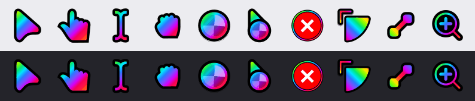
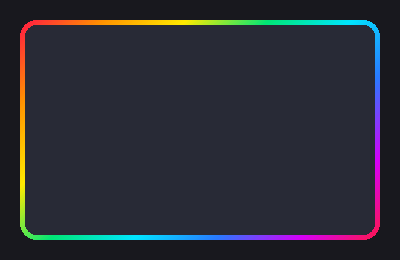

# Bibata-RGB



Анимированный радужный курсор на основе [Bibata Modern Ice](https://github.com/ful1e5/Bibata_Cursor)
для Hyprland (hyprcursor + XCursor) и вращающиеся радужные рамки окон. Одна команда
включает всё, другая возвращает исходную тему и прежние цвета рамок.

- Белое тело всех 56 курсоров (145 имён с алиасами) заменено радугой, которая плавно течёт
  вдоль формы; один цикл — 2,16 с. Чёрный контур, бейджи и размер остаются как у Bibata.
- Рамки окон — радужный градиент, который вращается: один оборот за 5 с.
  Неактивные окна — та же радуга, приглушённая.



*English summary at the end.*

## Установка

Рассчитано на Hyprland с конфигом на Lua (проверено на 0.56.2) и сессию через uwsm — как в
CachyOS Hyprland (noctalia). Подойдёт и свежая система.

```bash
shelly install standard --needed python-gobject python-cairo librsvg hyprcursor
git clone https://github.com/blackixxce12/bibata-rgb.git
cd bibata-rgb
./install.sh
~/.local/bin/rgb-theme on
```

Полный путь нужен только в первый раз: на свежей системе папки `~/.local/bin` ещё нет, и fish
добавит её в PATH только в новых терминалах. Дальше достаточно `rgb-theme ...`.

`install.sh` собирает тему (несколько секунд), ставит её в `~/.local/share/icons/Bibata-RGB`,
модуль рамок в `~/.config/hypr/config/rgb.lua` и переключатель `rgb-theme` в
`~/.local/bin`. Если в системе нет Bibata-Modern-Ice, он ставит оригинал из `vendor/`:
`rgb-theme off` возвращается именно к нему. Сам `install.sh` ничего не включает.

Для сборки нужны `python-gobject`, `python-cairo`, `librsvg` и `hyprcursor` (первая строка
выше; `--needed` пропускает уже установленные). На свежей CachyOS обычно не хватает
`python-cairo`. Если чего-то нет, `install.sh` скажет об этом и ничего не тронет. Если
`generate.py` или `vendor/` новее сборки (например, после `git pull`), `install.sh` соберёт
тему заново.

**Без сборки:** скачайте `Bibata-RGB.tar.xz` со страницы
[Releases](https://github.com/blackixxce12/bibata-rgb/releases), распакуйте его в `build/`
и запустите `./install.sh`. Сборка тогда пропускается.

```bash
mkdir -p build && tar -xJf Bibata-RGB.tar.xz -C build
```

## Управление

```bash
rgb-theme status            # что сейчас включено
rgb-theme on                # RGB-курсор и RGB-рамки
rgb-theme off               # вернуть Bibata-Modern-Ice и прежние рамки
rgb-theme off cursor        # только курсор назад (рамки остаются RGB)
rgb-theme off borders       # только рамки назад
rgb-theme toggle [cursor|borders]
rgb-theme spin loop         # рамки вращаются всё время (по умолчанию)
rgb-theme spin focus        # один оборот при фокусе окна, потом покой (экономнее)
rgb-theme spin off          # радуга стоит
```

`off` возвращает все изменённые файлы байт в байт, права файлов сохраняются. Перед правками
скрипт проверяет, что тема установлена, а `hyprland.lua` и `rgb.lua` на месте. Если
Hyprland недоступен, файлы всё равно переключаются, и изменения вступят в силу при
следующем входе.

Курсор меняется сразу. Уже запущенные приложения и курсор XWayland по умолчанию
переключаются после перезахода в сессию. Окна, открытые, пока рамки не двигались (рамки
выключены или `spin off`), вращаются непрерывно только после переоткрытия: Hyprland
включает зацикливание при открытии окна. До этого они делают один оборот при каждом
фокусе. После `off` → `on` рамки снова начинают вращаться, когда окно получит фокус.

### Что меняет rgb-theme

| Где | Что |
|---|---|
| `~/.config/uwsm/env` | `HYPRCURSOR_THEME`, `XCURSOR_THEME` |
| `~/.config/gtk-3.0/settings.ini` | `gtk-cursor-theme-name` |
| `~/.config/xsettingsd/xsettingsd.conf` | `Gtk/CursorThemeName` |
| `~/.icons/default/index.theme` | `Inherits=` |
| gsettings | `org.gnome.desktop.interface cursor-theme` |
| окружение systemd/dbus и Hyprland | `XCURSOR_THEME`, `HYPRCURSOR_THEME` (на лету) |
| `~/.config/hypr/hyprland.lua` | строка `require("config.rgb")` после `require("config.workspaces")` |

Отсутствующие файлы пропускаются; если в `~/.config/uwsm/env` нет строки
`export HYPRCURSOR_THEME=...`, скрипт предупредит, что после перезахода тема не сохранится.
Размер курсора не меняется.

## Настройка

Цвета, скорость вращения (`speed = 50` — это 5 с; меньше — быстрее) и прозрачность
неактивных рамок (`"66"`) задаются в `hypr/rgb.lua`; после правки запустите `./install.sh`.
Правки, внесённые прямо в установленный `~/.config/hypr/config/rgb.lua`, `install.sh`
сохраняет в `rgb.lua.bak-<дата>` и заменяет файл; режим `spin` переносится.

У заблокированных групп окон тёплая радуга. Полоски вкладок групп Hyprland рисует одним
цветом: фиолетовый, у заблокированных — оранжевый.

Курсор: палитра (`RAINBOW`), длина цикла (`CYCLE_MS`), число кадров и размеры XCursor —
константы в начале `generate.py`. После правки: `python3 generate.py && ./install.sh`,
затем `rgb-theme on`, чтобы Hyprland перечитал тему.

## Удаление

```bash
rgb-theme off
rm ~/.config/hypr/config/rgb.lua ~/.local/bin/rgb-theme
rm -r ~/.local/share/icons/Bibata-RGB
```

## Как это устроено

- `generate.py` берёт SVG-исходники Bibata-Modern-Ice из `vendor/` и заменяет белый цвет
  тела повторяющимся радужным градиентом, который в каждом кадре сдвигается на долю
  периода. Направление градиента выбирается по оси формы: у карандаша и диагональных стрелок
  радуга идёт вдоль них. Особые формы:
  - у X_cursor и wayland-cursor радужный светлый контур;
  - у «запрещено» (crossed_circle) тонкое радужное кольцо внутри чёрного края;
  - у угловых курсоров изменения размера сектор окрашен радугой со сдвигом на полпериода,
    чтобы уголок-указатель выделялся;
  - лопасти спиннера ожидания — чередующиеся светлые и тёмные полупрозрачные.
- hyprcursor: SVG-кадры, 36 кадров × 60 мс, у спиннеров 54 × 40 мс. SVG рисуются ровно в том
  размере, который просит Hyprland (24 × наибольший масштаб мониторов), поэтому курсор
  корректен при любом масштабе. Проверено на 20–72 px против оригинала: покрытие и хотспоты
  совпадают у всех 145 имён.
- XCursor (для XWayland и GTK3): размеры 24/32/40/48/64, 24 кадра × 90 мс (спиннеры 54 × 40),
  ~53 МБ на диске. Запросы за пределами 24–64 получат ближайший размер (оригинал: 16–96).

### Цена

Замеры на ноутбуке с RTX 3060 и экраном 165 Гц, масштаб 1,6:

- Каждая загрузка темы рисует все ~2050 кадров: ~0,5 с, и Hyprland в это время стоит.
  Загрузка бывает при старте, при `rgb-theme on` и дважды при каждой смене раскладки мониторов
  (пробуждение, переключение VT, подключение монитора) — около 1 с. `rgb-theme off` грузит
  исходную тему за ~0,04 с.
- Память Hyprland: +~25 МБ, после перезахода ещё ~+30 МБ (его XCursor-менеджер грузит все
  145 анимированных файлов). Программы, которые сами грузят всю XCursor-тему
  (libwayland-cursor, GTK3), тратят на курсоры примерно в 7 раз больше памяти, чем с
  оригиналом (~34 МБ против ~5 МБ при 48 px). Современные приложения просят курсор у
  Hyprland по протоколу cursor-shape и этого не платят.
- `spin loop`: пока на экране есть вращающаяся рамка, Hyprland перерисовывает экран на
  частоте обновления вместо простоя, а его таймер анимаций просыпается ~1000 раз/с (и тикает,
  даже если окно скрыто). Это ~4–6 % ядра, и видеокарта всё время рисует кадры. На батарее
  экономнее `rgb-theme spin focus`.
- PNG-вариант (`python3 generate.py --hypr-format png`) грузится мгновенно, но libhyprcursor
  0.1.13 обрезает PNG-кадры, которые приходится заметно уменьшать (при масштабе 1, 1,25 и
  1,75 курсор был бы срезан). Поэтому по умолчанию SVG.

## Инструменты

Для превью нужен Pillow: `shelly install standard --needed python-pillow`.

- `python3 preview.py` — `build/preview.png`: все курсоры, 4 фазы, на светлом и тёмном фоне.
- `python3 tools/make_previews.py` — GIF-превью в `docs/`.
- `tools/hctest.cpp` — загрузка темы через libhyprcursor: время, память, кадры, хотспоты и
  покрытие по формам.

  ```bash
  bash -c 'g++ -O2 -std=c++20 tools/hctest.cpp -o tools/hctest $(pkg-config --cflags --libs hyprcursor cairo)'
  tools/hctest Bibata-RGB 38 left_ptr wait text
  ```

## Лицензия

GPL-3.0 (см. `LICENSE`). Bibata Cursor — автор Abdulkaiz Khatri (ful1e5),
<https://github.com/ful1e5/Bibata_Cursor>, GPL-3.0. Неизменённая копия Bibata-Modern-Ice
лежит в `vendor/` (подробнее — `vendor/README.md`).

---

## English summary

An animated rainbow version of the Bibata Modern Ice cursor for Hyprland (hyprcursor and
XCursor), plus rainbow window borders that keep turning, with a switch that puts everything
back.

```bash
sudo pacman -S --needed python-gobject python-cairo librsvg hyprcursor
git clone https://github.com/blackixxce12/bibata-rgb.git && cd bibata-rgb
./install.sh                 # builds the theme, installs theme + border module + rgb-theme
~/.local/bin/rgb-theme on    # later just: rgb-theme off / on / status
rgb-theme spin focus         # borders turn once on focus instead of all the time (cheaper)
```

Needs Hyprland with a Lua config (tested on 0.56.2) and a uwsm session (the CachyOS Hyprland
layout); building needs python-gobject, python-cairo, librsvg and hyprcursor. A prebuilt
theme (Bibata-RGB.tar.xz, unpack into build/) is attached to the releases. The theme is generated from the GPL-3.0 Bibata sources
kept in `vendor/`. The turning borders keep Hyprland redrawing at the monitor's refresh rate
(about 4–6 % of a CPU core in the author's measurements), and loading the animated theme
takes about 0.5 s.
